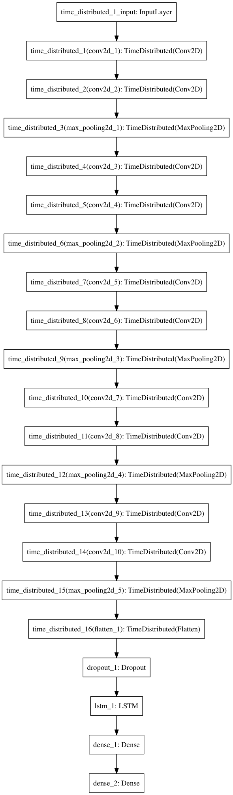
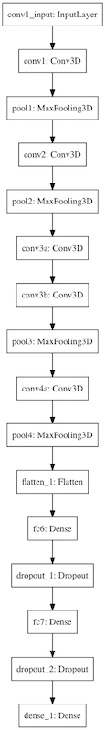
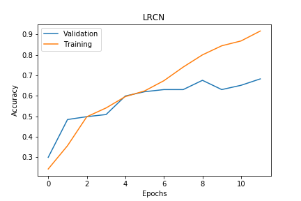
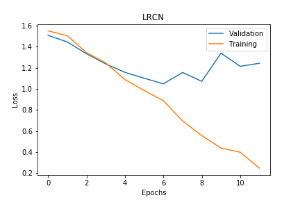
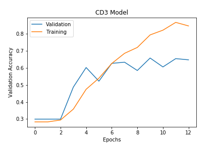
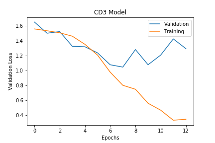
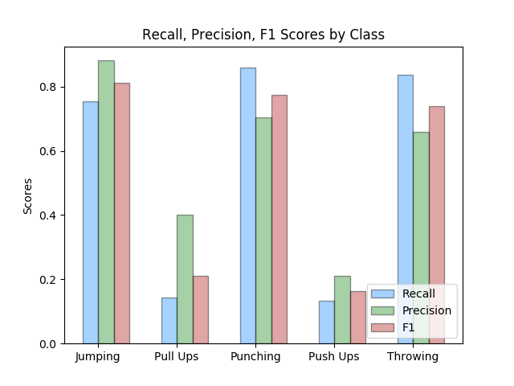

<h2>Readme</h2>

<h2> Video Classification of Semi Natural Human Movements </h2>

<h3>Overview</h3>

The goal of this project is to build a video classifier that correctly predict five different human movements. The movement that I wish to classify are: throwing, jumping, punching, push-ups, and pull-ups,

<h3>Motivation</h3>

My interest in this problem came about when I was introduced to a new type of camera that has a built-in GPU. This got me thinking, could you possibly train a model, extract the weights/parameters, load them into the camera, and conduct real time video classifications? The neurons began to fire (pun intended) and the possible applications of this type of technology started to surface. With some conversation and direction from my peers we started to discuss the implementation of this in the domain of security. What if we could classify suspicious behavior? What does that mean to a computer? With these thoughts ingrained in my head I decided to take on a small subset of the larger problem stated previously. I found a video dataset from the University of Central Florida called UCF101. With the dataset at hand, I categorized the dataset into five human actions that I saw as a good segue into the broader problem presented: throwing, punching, jumping, push-ups, pull-ups.

<h3>Data</h3>

The data I am using for this project is the [UCF101 - Action Recognition Data Set](http://crcv.ucf.edu/data/UCF101.php). The set contains around 13,000 videos with 101 categories. I will be using a subset of the categories to create my own 5 classifications. All the clips are from YouTube with a fixed frame rate of 25 FPS and a resolution of 320 X 240. I will be creating JPEG images from each frame and using the images over a predetermined timestamp to train my model.

From this dataset I grouped eight of the categories into my 5 targets as described previously. Jumping consisted of trampoline jumping and high jump. Throwing consisted of javelin throw and baseball pitch. Punching consisted of heavy bag and speed bag punching. Finally push-ups and pull-ups consisted of just those movements. In dissecting this dataset I did run into issues with class imbalance and limited amount of data. Push-up and Pull-up classes were about 40% of the size of the other three classes. As a whole I lacked a significant amount of data to truly see the optimal performance of my model.

| Label  |  Train # of Clips |  Test # of Clips |
|---|---|---|
| Jumping |  173 |  69 |
| Pull-ups  |  72 | 28  |
|  Punching |  211 |  86 |
| Throwing  | 193  |  74 |
| Push-Ups  |  72 | 30  |

Using FFMPEG, each clip was broken up into individual frames. All frames were then preprocess to the correct size, sequence length, and RGB or B/W depending on the model used for training.

Dealing with class imbalance was an issue. That is something that future work.

<h3>Models</h3>

The two models that I trained my model on was a Long-term Recurrent Convolution Neural Network (LRCN) and a three dimensional convolutional neural network.

|Long-term Recurrent Convolution Neural Network| 3D Convolutional Model|
|---|---|
|||

|Training vs Validation Accuracy| Training vs Validation Loss|
|---|---|
||
||

The final model I used to train on my data was LRCN. This model provided a little higher accuracy and better precision, recall and f1 score.

Along with a boost in scoring metrics, computationally LRCN was less demanding. Moving forward I would like to optimize my memory usage, using generators and parallelization.

<h3> Training My Models</h3>

The training of my models was implemented on the p2.xlarge instance provided by Amazon Web Services. Multiple parameters and hyper-parameters were tried to get my optimal score.

|Learning Rate| Decay Rate| Epochs| Batch Size |
|---|---|---|---|
|0.0001|0.000005|12|32|

<h3>Visualizations</h3>
These two gifs are visual representations a sequence of 25 images being passed through each convolutional layer
  

  

<h3>Next Step</h3>

My biggest next step is to gather more data. This is very importing in generalizing each potential movement along with getter better accuracy from my model. I also want to add more labels, such as waving, bending over, running, etc. Once more data is gather I would like to test different models and ways of tracking movements frame by frame with something like optical flow. Once my model is at a place I am happy with, live classifications would be the next step.

<h3>References</h3>
- 

- 

- 
